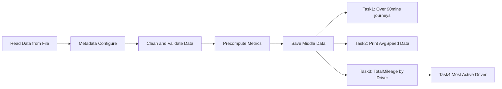

# Task Links
1. Task Srouce:
[Data Engineering coding test]( https://github.com/overseaworld/de-coding-test-jason-wei)

2. Run the following command first:
```bash
# Entry the repository
cd de-coding-test-jason-wei/

# main 
scala src/main/java/ai/humn/telematics/ProcessDataFile.scala src/test/resources/2021-10-05_journeys.csv 2021-10-05

# unittest
scala src/test/java/ai/humn/telematics/ProcessDataFileTest.scala src/test/resources/2021-10-05_journeys.csv 2021-10-05

```
# How to approach this task
Here is the main steps to approach this task:

1). **Business Understanding:**
   - Understand the business context 
   - Understand the business objectives
  
2). **Requirement Analysis:**
   - Understand the functional and non-functional requirements.
   - Identify performance criteria such as processing speed, memory usage, and scalability.

3). **Exploratory Data Analysis (EDA):**
   - Analyze data distribution and identify performance bottlenecks.
   - Optimize data access patterns and algorithms based on EDA findings.

4). **Data Modeling:**
   - Streamline the overview data processes.
   - Design efficient data structures for storing and processing data.

5). **Data Processing:**
   - Development the functions and methods.Implement algorithms that minimize computational complexity
   - Consider the dependencies and non-functional performance boosting.

6). **Data Quality Check (DQC):**
   - Validate data quality enhancements do not compromise performance.
   - Integrate performance metrics into DQC processes for continuous monitoring.

7). **Scenarios and Future Work:**
   - Identify potential scenarios where performance improvements are critical (e.g., real-time processing, large-scale data sets).
   - Plan for future enhancements focusing on scalability, parallel processing, and integration with advanced analytics frameworks.


# 1.Business Understanding

## 1.1). Business Context
- **Company Overview:** Our organization specializes in leveraging journey data within the transportation and logistics industry.
- **Industry:** Transportation and Logistics.

## 1.2). Objectives
- **Operational Efficiency:** Optimize routes, reduce idle time, improve fuel efficiency.
- **Driver Performance:** Monitor driving behavior, provide feedback for training.
- **Customer Service:** Predict service demand, enhance response times.
- **Regulatory Compliance:** Accurate reporting of mileage, hours of service.


# 2. Requirement Analysis

## 2.1). Introduction
The goal of this implementation is to process telematics data from a file, perform data validation, cleaning, and compute various metrics related to driver journeys. The processed data will be used to derive insights such as journey durations, distances traveled, average speeds, and total mileage by drivers for a given day.

## 2.2). Functional Requirements

### 2.2.1). Data Ingestion and Parsing:
- Read data from a specified file path.
- Parse each line of data using a predefined schema (`schemaV1FieldToIndex`).
- Convert parsed data into structured `JourneyMetadata`.

### 2.2.2). Data Validation and Cleaning:
- Validate each journey record based on predefined rules (e.g., start time before end time, positive odometer readings).
- Log warnings for invalid or incomplete records.
- Cleanse data by filtering out invalid records.

### 2.2.3). Metrics Computation:
- Compute journey metrics such as distance traveled, duration, average speed.
- Handle scenarios where duration or distance calculations might be ambiguous or incomplete.

### 2.2.4). Queries and Reporting:
- Implement functions to query journeys based on duration ranges.
- Calculate total mileage per driver for a given day.
- Identify the most active driver based on total mileage.

### 2.2.5). Logging and Error Handling:
- Use logging to capture warnings and errors during data processing.
- Handle exceptions gracefully to ensure robustness of the application.

## 2.3). Non-Functional Requirements

### 2.3.1). Performance:
- Efficiently process large datasets.
- Minimize memory footprint by using efficient data structures.

### 2.3.2). Scalability:
- Design functions to support future enhancements such as additional schema versions or new metrics.
- Support batch processing or parallel processing for scalability.

### 2.3.3). Maintainability:
- Write clean, modular code with descriptive comments.
- Use meaningful variable names and follow consistent coding conventions.

### 2.3.4). Reliability:
- Ensure accurate data processing and metric computations.
- Validate outputs against expected results to maintain reliability.

## 2.4). Constraints
- Data must adhere to the specified schema (`schemaV1FieldToIndex`).
- Handle potential discrepancies or incomplete journey data gracefully.

## 2.5). Assumptions
- The input data file is formatted correctly according to the specified schema.
- The application runs in a single-threaded environment for simplicity.

## 2.6). Future Enhancements
- Support for additional schema versions through configuration.
- Integration with a data warehouse for persistent storage of cleansed data and computed metrics.
- Real-time data processing capabilities for streaming data sources.


# 3. Exploratory Data Analysis (EDA)

## 3.1). Introduction
The Exploratory Data Analysis (EDA) are essential processes in understanding the characteristics of the telematics data, identifying patterns, and ensuring its reliability for further analysis and processing.

## 3.2). Dataset Overview
- **Source:** Telematics data stored in a CSV file format.
- **Structure:** Each record represents a journey with attributes such as journey ID, driver ID, timestamps, geospatial coordinates, and odometer readings.
- **Schema:** Defined by `schemaV1FieldToIndex` mapping in the implementation.

## 3.3). EDA Findings

### 3.3.1). Data Distribution and Summary Statistics

#### Numeric Fields:
- **Start and End Odometer Readings:** Examined for range, distribution, and presence of outliers.
- **Distance Traveled:** Analyzed for distribution and variability across journeys.
- **Duration:** Investigated for distribution and relationship with distance and average speed.

#### Temporal Fields:
- **Start and End Times:** Reviewed for time span covered by data, peak activity periods, and potential gaps or irregularities.

#### Geospatial Coordinates:
- **Start and End Locations (Latitude, Longitude):** Visualized for distribution and clustering patterns.

### 3.3.2). Data Quality Issues

- **Missing Values:** Checked for missing data points in essential fields such as journey ID, timestamps, and geographical coordinates.
- **Outliers:** Identified outliers in odometer readings, duration, and distance calculations.
- **Data Consistency:** Ensured consistency between start and end times, odometer readings (start < end), and valid journey durations.
- **Format Errors:** Addressed potential errors in data formatting and adherence to the specified schema.


# 4. Data Modelling
## 4.1). Data Processing
Below is a high-level diagram illustrating the process flow of the implementation:


## 4.2). Class and Object Structure

### ProcessDataFile (Object):
- Main entry point containing the main method.
- Responsible for file handling, data processing orchestration, and output generation.

### JourneyMetadata (Case Class):
- Represents structured journey data after parsing and validation.
- Contains fields such as journeyId, driverId, timestamps, geospatial coordinates, odometer readings, computed metrics (distance, duration, average speed).

### TotalMileageMap (Object):
- Represents structured mileage data after grouping by driver
- Contains fields: driver_id, totalMileage


# 5. Data Processing 
## 5.1). Functions and Methods

### 5.1.1). cleanData:
- **Input:** Raw string representing a journey record.
- **Output:** Optional JourneyMetadata instance or None for invalid records.
- Performs validation, parsing, and computation of metrics for each journey.

### 5.1.2). queryByDurationRange:
- **Input:** List of JourneyMetadata, duration start, duration end.
- **Output:** Optional JourneyMetadata matching the specified duration range.
- Filters journeys based on duration criteria.


### 5.1.3). aggregateByDriver:
- **Input:**  List of JourneyMetadata.
- **Output:** Map[String, Double] containing total mileage per driver.
- Function to aggregate and calculate total mileage driven by each driver based on provided journey data. Uses functional programming techniques to group journeys by driver ID and compute cumulative distances.

### 5.1.4). queryJourneysByMinimumDuration:
- **Input:** List of JourneyMetadata, duration threshold.
- **Output:** Prints journeys meeting the specified duration threshold.
- Utility function to query and print journeys based on a duration threshold.


### 5.1.5). queryJourneysByAverageSpeedRange:
- **Input:**  List of JourneyMetadate, average speed range [avgSpeedStart, avgSpeedEnd]
- **Output:** Prints average speed per journey in kilometers per hour (kph), which avgSpeed is between avgSpeedStart and avgSpeedEnd.
- Computes and return the average speed for each journey in a given list of JourneyMetadata objects. Provides insights into driving behaviors and performance metrics derived from telemetry data.

### 5.1.6). printJourney, printJourneyList:
- Utility functions to print individual journeys or lists of journeys with formatted details.

## 5.2). Dependencies

- **Java Time API (`java.time`):** Used for handling date/time operations and formatting.
- **Scala Collections (`scala.collection.mutable.ListBuffer`):** Utilized for managing collections of journey records and computed metrics.
- **Logging (`java.util.logging.Logger`):** Provides logging capabilities for warning and error messages during data processing.
- **File Handling (`scala.io.Source`, `java.nio.file.Paths`):** Reads input data from a file path and manages file-related operations.

## 5.3). Scalability Considerations

- The current implementation supports batch processing of journey data from a file.
- Designed functions and structures allow for potential future enhancements like parallel processing or integration with distributed computing frameworks.

## 5.4). Error Handling

- Exception handling within `cleanData` ensures that processing continues in the face of invalid or malformed data.
- Log messages are generated for warnings and errors to aid in debugging and maintaining data integrity.


## 6. Data Quality 

### Cleaning and Preprocessing Steps

- **Missing Data Handling:**
  - Implement strategies such as imputation for missing values in non-critical fields.
  - Exclude records with essential missing data to maintain dataset integrity.

- **Outlier Treatment:**
  - Apply statistical methods (e.g., Z-score, IQR) to identify and handle outliers in numeric fields.
  - Consider domain knowledge to validate or correct extreme values where appropriate.

- **Consistency Checks:**
  - Validate logical relationships (e.g., start < end for timestamps, end > start for odometer readings) to ensure data consistency.
  - Implement filters or rules to flag and manage inconsistent records.

- **Format and Schema Validation:**
  - Ensure all records conform to the defined schema (`schemaV1FieldToIndex`) during parsing and processing.
  - Log discrepancies or inconsistencies for further investigation.


## Future Enhancements

- **Advanced Analytics:** Explore correlations between journey attributes (e.g., duration vs. distance, average speed vs. time of day).
- **Real-Time Monitoring:** Implement continuous monitoring for incoming data streams to detect and address quality issues promptly.
- **Integration:** Integrate EDA and DQC processes into automated pipelines for scalability and efficiency in data processing.
- 

# 7. Future Work: Enhancing Driver Behavior and Geo Features

## 7.1). Introduction
Future enhancements to the existing implementation will focus on enriching driver behavior features and geographical (Geo) capabilities. These improvements aim to support a broader range of scenarios and enhance the depth of analysis and insights derived from telematics data.

## 7.2). Driver Behavior Features

### Expanded Driver Metrics
- **Acceleration and Deceleration Patterns:** Calculate metrics based on changes in speed over time intervals.
- **Speed Variability:** Assess how speed fluctuates during journeys to identify aggressive driving behavior.
- **Idling Time:** Measure time spent with the engine running but the vehicle stationary.
- **Fuel Efficiency:** Estimate fuel consumption based on driving patterns and distances.

### Behavioral Analysis
- **Driver Profiling:** Develop profiles based on driving habits, including frequent stops, speeding, or efficient driving.
- **Anomaly Detection:** Implement algorithms to detect unusual driving behavior that may indicate risk or inefficiency.

## 7.3). Geographical (Geo) Features

### Enhanced Geo Spatial Analysis
- **Geo-fencing:** Define geographic boundaries and monitor journeys crossing these boundaries.
- **Route Analysis:** Analyze common routes, deviations, and optimize driving paths.
- **Location-Based Insights:** Utilize geographical data for contextual analysis, such as urban vs. rural driving behavior.

### Advanced Geo-Data Integration
- **Weather Impact:** Integrate weather data to analyze driving behavior under different weather conditions.
- **Point of Interest (POI) Integration:** Analyze driving patterns relative to POIs like gas stations, parking lots, or service centers.

## 7.4). Implementation Considerations

### Data Collection and Integration
- **Real-Time Data Streaming:** Implement capabilities for processing streaming data to support live monitoring and immediate insights.
- **Integration with External APIs:** Access external data sources such as weather APIs for enriched analysis.

### Scalability and Performance
- **Parallel Processing:** Optimize algorithms and data structures to leverage parallel processing frameworks for scalability.
- **Data Warehousing:** Integrate with a data warehouse for long-term storage and historical analysis of enriched data.

## 7.5). Performance Considerations
- **Algorithm Complexity:** Choose algorithms with optimal time and space complexity.
- **Data Structures:** Use appropriate data structures (e.g., hash maps, trees) for efficient data access and manipulation.
- **Parallel Processing:** Implement parallelism where feasible to distribute workloads and improve throughput.
- **Resource Management:** Monitor and optimize resource usage (CPU, memory, disk) during data processing.
- **Caching:** Utilize caching mechanisms to reduce repetitive computations and improve response times.

## 7.6). Conclusion
Enhancing driver behavior and Geo features will enable more comprehensive analysis of telematics data, providing valuable insights into operational efficiency, safety measures, and driver performance. These advancements are essential for supporting diverse use cases across industries such as logistics, transportation, and fleet management.


# Summary
By following this workflow and incorporating performance considerations at each stage, we can enhance the efficiency and responsiveness of your data processing system, ensuring it meets both current and future performance requirements.


# Thank you for your time and efforts.


